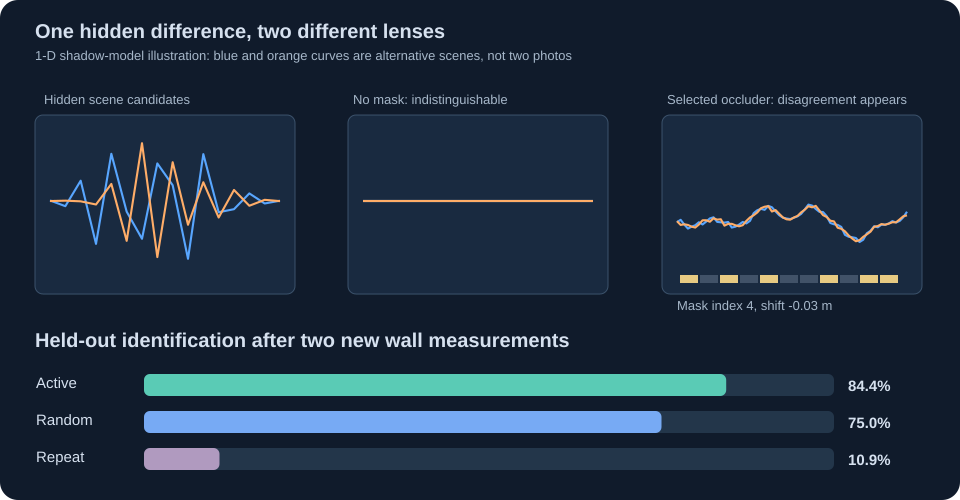

# LensLuotainTarget — when a shadow becomes a question

> A pair of hidden states can produce the same present observation, but a carefully chosen new measurement can expose their difference. Can an observer choose that measurement without knowing which state is real?

**In a held-out, one-dimensional simulated periscopy task, yes:** after an initially uninformative photograph, selecting two occluders by predicted disagreement identified the correct member of eight candidate hidden images in **54/64 trials (84.4%)**, versus **48/64 (75.0%)** for random occluders and **7/64 (10.9%)** for repeatedly photographing without a mask. Mean negative log-probability of the true candidate was **0.294 / 0.642 / 2.079 nats** respectively. The active improvement over random is useful but small-sample and dependent on a known forward model, a known finite candidate set, and synthetic noise. This is not an image-reconstruction system for an unknown real scene.



[Open the interactive shadow-lens explainer!](https://anttiluode.github.io/LensLuotainTarget/site/index.html). Move and edit a coded mask to see how visually different hidden images can make almost the same unmasked wall signal but different masked signals. This is a geometric explainer, not the statistical benchmark.

## Memory → gate → soma: the next tested mechanism

[Open the memory, gate and soma experiment](https://anttiluode.github.io/LensLuotainTarget/site/index.html#neuron).
Different stimulus histories leave twelve different leaky branch traces while sharing the same current input and initial soma sum. The receiver sees only the selected gate identity and noisy scalar output. Its retained belief over eight supplied histories guides the next gate.

In **512 held-out seeds**, three new memory-guided reads identify **294/512 (57.4%)** histories, versus **208/512 (40.6%)** random, **216/512 (42.2%)** fixed and **272/512 (53.1%)** when gate selection discards previous answers. After-mixing and erased-memory controls remain near chance. With an imposed read-write effect, guided accuracy is **290/512 (56.6%)**, while mean relative branch-state disturbance reaches **16.4%**. Both conditions pass the frozen gates; the gain over the strong open-loop comparison is modest.

This is an **abstract linear history/readout model**, with a known candidate dictionary, correct dynamics and a programmed selector. It is not a learned biological gate, a spike-waveform model or a demonstrated new AI architecture. The site exposes the two memories separately: retained branch history and the observer's retained answers. [Protocol](NEURON_PROTOCOL.md), [outcome ledger](NEURON_RESULTS.md), and [receipt](results/memory_gate_soma.json) preserve the controls and costs.

The original [PerceptionLab ecg.json accident](https://github.com/anttiluode/GeometricNeuronOriginReview) supplies the observation-in-feedback question; its aliasing/variance-controller pulse has different equations. [AnttisBrain2's moons](https://github.com/anttiluode/AnttisBrain2), [MovingTarget2](https://github.com/anttiluode/MovingTarget2) and [BrainAsInverseModeler](https://github.com/anttiluode/BrainAsInverseModeler) contribute the lens, response-memory and soma-transmission questions.

## Learning the gate without the eight-history catalogue

[Run the actual trained receiver](https://anttiluode.github.io/LensLuotainTarget/site/learned.html). It learns three gates from continuous stimulus histories, receives only noisy scalar answers and its own issued commands, and predicts answers to final linear questions it did not see while choosing those gates. Change the final question in the browser to reuse the same acquired readings.

On **512 fresh histories with dense signed final questions**, averaged over **three training seeds**, adaptive gating reduced future-answer **MSE by 20.1% versus an optimized fixed schedule and 19.2% versus a comparable-resource recurrent receiver**. On a withheld switching-history family, the gains were **11.2% and 9.9%**. All five frozen gates passed. The full prediction-plus-disturbance objective improved too, although adaptive reads moved the retained state more than fixed reads.

This establishes an advantage for this learned interface in a small known simulator. Training still uses exact simulator gradients and supervised answers, the twelve-coordinate linear-query interface is built in, and the comparison covers a specific tanh recurrent baseline. Adaptive commands also add nonlinear receiver computation and outbound communication. The result does not isolate every benefit of physical gate placement or establish general architecture superiority.

[Frozen protocol](LEARNED_PROTOCOL.md), [complete results and limits](LEARNED_RESULTS.md), [receipt](results/learned_queries.json), and [all twelve selected weight sets and validation traces](results/learned_weights.json) are published. The older dictionary and optical experiments remain separate.

## Why these three repositories meet

- [Varjoluotain](https://github.com/anttiluode/Varjoluotain) implements the 2019 ordinary-camera computational-periscopy paper: a known occluder makes hidden image components more observable. Here we use a small original **1-D analogue**, not its validated 2-D transport or its photographs.
- [MovingTarget2](https://github.com/anttiluode/MovingTarget2) defines memory by query responses. Identical weak answers need not imply identical future responses. Here one unmasked response cannot distinguish candidate hidden images; some physically different new measurements can.
- [Luotain](https://github.com/anttiluode/Luotain) asks which cheap tests actually distinguish rival explanations. Here the active policy explicitly selects the most discriminating predicted shadow.
- [AnttisBrain2](https://github.com/anttiluode/AnttisBrain2) supplied the geometric intuition of a changing lens or moon. The new masks are actual mathematical measurement operators, not claims that a rendered moon is itself an attention head.

## The forward model and the test

A scene is sixteen one-dimensional luminous patches at y=0. A wall sensor has 64 pixels at y=D. Rays travel from each scene patch to each wall pixel. A small binary mask may block rays at intermediate y. Finite subsources turn the mask edge into a soft penumbra. The intensity model follows the parallel-plane Lambertian form D²/r⁴, calibrated once against the unmasked uniform screen:

```text
    hidden patches            mask at intermediate depth                 wall camera
    [ x x x x x ]  --------->  | # . # # . # . . # . # |  ----------->  [ 64 values ]
                                  move / recode mask
```

A candidate hidden image x predicts y_p=A_p x for each mask p. The initial no-mask measurement makes eight candidate images nearly indistinguishable **by construction**: they are assembled in the least-observable singular-vector directions of A_0. This is an ambiguity stress test, not a natural-image sample. The true candidate index is drawn independently and is hidden from the selector.

The observer estimates a posterior probability over the eight candidates. It chooses the available mask that maximizes posterior-weighted predicted wall variance, equivalent up to constant factors to expected pairwise Gaussian KL under equal independent sensor noise. Then it takes a noisy measurement and updates the posterior. Random-mask and repeated-no-mask observers have the same number of observations and the same candidate dictionary.

## Held-out result, with the imperfection preserved

| Model, 2 extra views | Correct / 64 | Accuracy | Mean true-label log loss | Mean final uncertainty (bits) |
|---|---:|---:|---:|---:|
| Select next mask by disagreement | **54** | **84.4%** | **0.294** | **0.627** |
| Uniform random mask | 48 | 75.0% | 0.642 | 1.018 |
| Repeat no-mask photograph | 7 | 10.9% | 2.079 | 3.000 |

The **predeclared corrected gates passed** on seeds 6100–6163: active minus random accuracy +9.4 percentage points, random minus active log loss +0.348 nats. The precise gate conditions and outcome/fix history are in [PROTOCOL.md](PROTOCOL.md) and [RESULTS.md](RESULTS.md). The seed-varying candidates were introduced after catching a generator defect: an earlier 5100-series run unintentionally reused effectively the same candidate set. That earlier positive result is disclosed as a **pilot**, not counted as the corrected held-out outcome.

There is no learned encoder, real-camera measurement, blind 2-D reconstruction, moving neural frame or demonstrated improvement over prior work in experimental design. The active selector evaluates all 30 candidate masks each step, unlike random selection; we do not claim compute-matched speed or low-cost hardware deployment.

## Run

```bash
python -m pip install -r requirements.txt
python -m unittest discover -s tests -v
python experiment.py                     # 64 held-out seeds, two new views
python experiment.py --seeds 5 --output /tmp/lens-smoke.json
python verify_learned_receipt.py         # reproduce learned held-out metrics; no retraining
python make_learned_site_data.py --verify # export actual weights and verify browser parity
# Optional full retraining: move the existing weights aside first.
python learned_experiment.py train --weights /tmp/retrained-weights.json
python learned_experiment.py evaluate --weights /tmp/retrained-weights.json --output /tmp/retrained-receipt.json
```

`results/summary.json` gives the frozen aggregate results; the complete detailed per-seed receipt can be regenerated deterministically with the script. Only NumPy is required. The one-page browser visual uses plain JavaScript and runs locally.

## The mathematical point

The information is not necessarily absent from the world; it can be **unobservable through a particular measurement operator**. If x and x' satisfy A_0(x-x')≈0, the initial view cannot separate them reliably. A new mask changes the operator to A_p. If A_p(x-x') is large compared with noise, the hidden difference becomes measurable. For several measurements, exact unobservable differences lie in the **intersection of their kernels**. No amount of computation can distinguish exact twins through the original unchanged operator, but changing the operator can change what is identifiable.

This is established inverse-problem and active experimental-design mathematics, not a claim of a new theorem. The next scientific step is testing a calibrated two-dimensional camera setup with unknown candidates or real measurements, including model mismatch and photon noise; the first gate deliberately stays smaller.

Source: Saunders, Murray-Bruce & Goyal, [*Computational periscopy with an ordinary digital camera*](https://www.nature.com/articles/s41586-018-0868-6), *Nature* 565 (2019).
